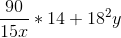
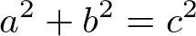

# Python Variables

Often in programming we want to use some of our data in more than one place or we want to save a result for us to use later.

To do this we use **variables**. In Python, as with many other languages, we use **variables** to store our data for future use.

Let's say we want to ask the user of our program for their name. Last section we saw the `input()` function that we can use to get a string from a user.


```python
input("What is your name? ")
```

    What is your name?  Sandbox


    'Sandbox'


This works just fine but if we wanted to print "Hello, Sandbox" our code would look like this:


```python
print("Hello,", input("What is your name? "))
```

    What is your name?  Sandbox


    Hello, Sandbox


This works just fine but it is unclear what is really happening. If we can avoid it, we should never call a function in the `print()` function. The `print()` function has one job and by calling the `input()` inside the print statement we are giving `print()` another job. More importantly, we lose their name after we print it; if we wanted to reuse their name later we would need to ask them again! In order to avoid these pitfalls we are going to store their name in a **variable**.


```python
name = input("What is your name")
print("Hello, ", name)
```

    What is your name Sandbox


    Hello,  Sandbox


Notice the output is the exact same. But now we have the name stored in memory and we can use it *any time* we need.

So to store a value in a variable we do something like this:

`variable = value`

We use a single equal sign to **assign** a *value* to a **variable**. 

We have the freedom to choose our variable name. But we need to follow a few rules:
* Our variable name *must* start with a letter or an underscore (5guys is not a valid variable name)
* Variables can only contain letters, numbers, and underscores. (A-z, 0-9, _)
* Variable names *are* case sensitive. (age, Age, and AGE are three different variables)
* Our variable cannot contain spaces or reserved words. Some common reserved words:
    * and
    * or
    * if
    * else
    * class
    * for
    * while
    * etc...
* Our variables should not contain built-in function names like:    
    * sum
    * abs
    * input
    * print
    * Full list [here](https://docs.python.org/3/library/functions.html)
* Variables should be all lowercase with underscores to separate words. Some good variable names:
    * name
    * temp_before
    * temp_after
    * a_very_long_name
    * x
    * y
    
## Temperature Conversion
Lets use variables to create a useful application, converting Fahrenheit to Celcius!


```python
# Ask the user for a temperature, store to variable
Tempf = input("What is the temperature(f): ")

# Change that temp into a float, (from a string)
Tempf = float(Tempf)

# Convert that number into Celcius from Fahrenheit
# Tc = (Tf - 32) x (5/9)
TempC = (Tempf - 32) * (5/9)

# Print out that number. With some info
print("Celcius:", TempC)

# Going the other direction
# Tf = ((9/5) x Tc) + 32
Tc = input("What is the temperature(c): ")
Tc = float(Tc)
Tf = (9/5 * Tc) + 32
print("Fahrenheit:",Tf)
```

    What is the temperature(f):  32


    Celcius: 0.0


    What is the temperature(c):  15


    Fahrenheit: 59.0


Awesome! We can use these variables to make math easier as well.
For example, let's say we have an equation like:



We can use variables to easily evalueate this expression with different values of `x` and `y`.


```python
x = 3
y = 4
(90/ (15 * x)) * 14 + (18**2) * y
```


    1324.0


```python
x = 1
y = 1
(90 / (15 * x)) * 14 + (18**2) * y
```


    408.0


We will be using variables for the rest of our Python journey!. You will get lots and lots of practice creating and using variables in your programs so come back and take a look at the ideas above any time!

### Challenges
 1. Implement Pythogorean's Theorem:
 
 
 
 Given two sides of a right triable (a and b) calculate the length of the longest side (c). Things to keep in mind: 4 squared can be written as `4**2`, and we will need to use the square root function from the `math` module. Add `import math` to the top of the file and use `math.sqrt()` to find square roots.
